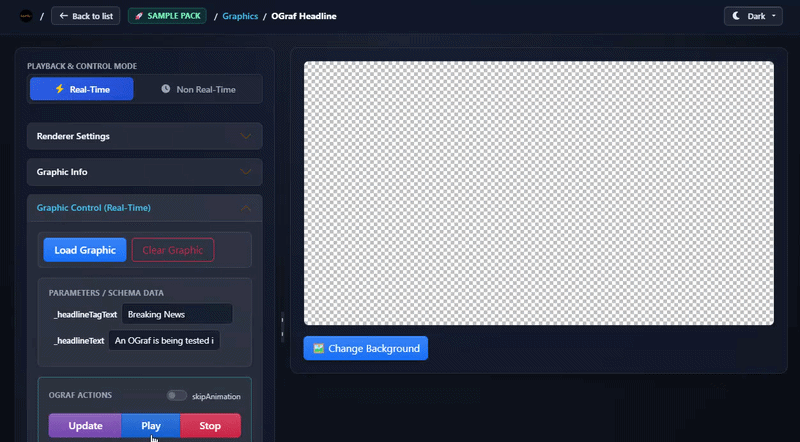
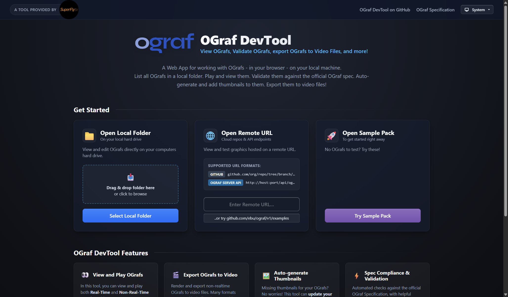
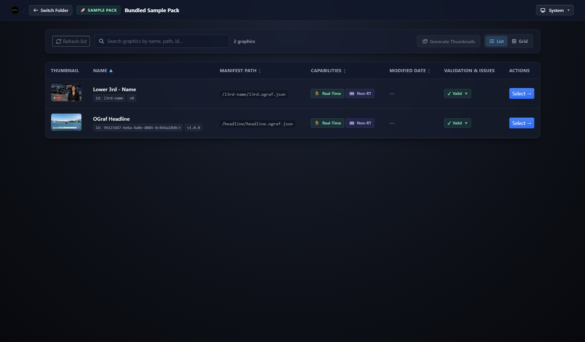
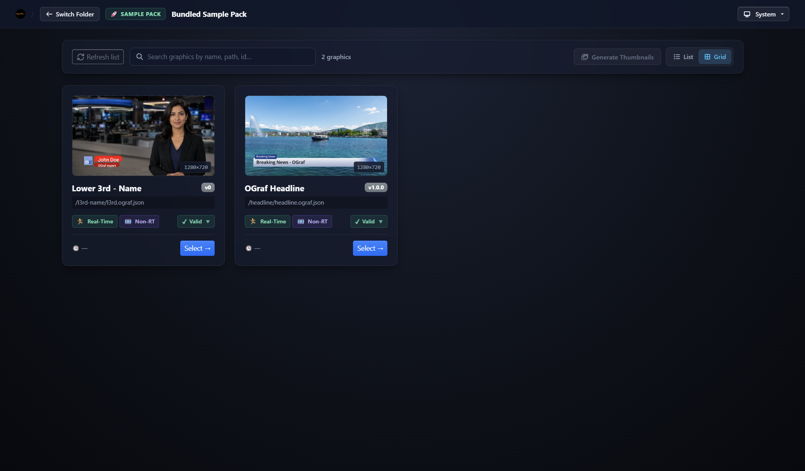
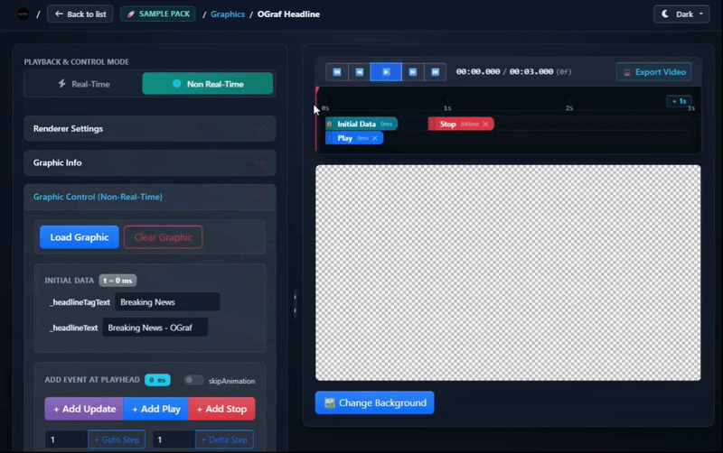
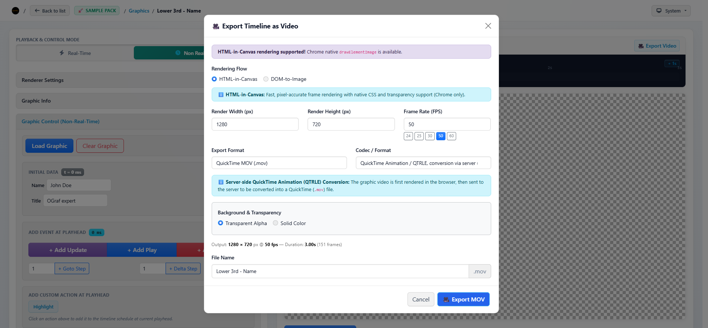

# OGraf Devtool

<p align="center">
  
</p>

<p align="center">
  <b>View OGrafs, validate OGrafs, export OGrafs to video files, and more!</b>
</p>

<p align="center">
  <a href="https://ograf-devtool.superfly.tv"><b>Running at ograf-devtool.superfly.tv</b></a>
</p>

---

## Overview

**OGraf DevTool** is a Web App for working with OGrafs - in your browser - on your local machine.
List all OGrafs in a local folder. Play and view them. Validate them against the official OGraf spec. Auto-generate and add thumbnails to them. Export them to video files!



---

## Key Features

### Local File Access, a repo URL or OGraf Server

- **Local Folder Access**: Open OGrafs directly from your local hard drive. No upload required.
- **Remote & Cloud Sources**: Load OGrafs directly from **GitHub** repos, or on **OGraf servers**.

<p align="center">
  
</p>

---

### Browse and list

Get a quick overview of your OGrafs, using the **list / grid view**.

The DevTool checks if there are any issues with the OGraf manifest or code.

<p align="center">
  
  
</p>

---

### Spec Compliance & In-Depth Validation

- **Automated Verification**: Automatically checks manifests and code structure against the official [OGraf Specification](https://ograf.ebu.io/).
- **Issue Tracker & Guidance**: Detects schema violations, missing required assets, runtime errors, and compatibility warnings with actionable debugging feedback.

---

### Interactive Playback & Testing

- **Real-Time Control GUI**:
  - Trigger actions (Play, Stop, Pause, custom actions).
  - Auto-generated dynamic form controls for data input, using [ograf-form](https://www.npmjs.com/package/ograf-form).
- **Non-Real-Time Timeline Controls**:
  - Frame-accurate timeline scrubber with playhead, play/pause, looping, frame stepping, and custom frame rate playback.

<p align="center">
  
</p>

---

### Export OGrafs as video

Render Non-Real-Time OGrafs directly to video files (with transparency) within the browser.

<p align="center">
  
</p>

---

### Automated Thumbnail Generator

- Automatically generate thumbnail images for OGrafs in batch or individually.
- Automatically writes thumbnail files to your local folder and updates the OGraf's manifest.

---

## Getting Started

### Using the Hosted Version

You can use the official hosted instance without installing anything:
**[ograf-devtool.superfly.tv](https://ograf-devtool.superfly.tv)**

---

### Running Locally for Development

```bash
# Clone the repository
git clone https://github.com/SuperFlyTV/ograf-devtool.git
cd ograf-devtool

# Install root and client dependencies
npm install
npm run install:client

# Start development mode (client + server with hot-reload)
npm run dev
```

The application will be available at `http://localhost:3100/` (or the port shown in your terminal).

---

## 🚢 Deployment

Commits merged into the `main` branch automatically trigger a GitHub Action that builds a Docker container and deploys it to the production environment.

---

## 💬 Feedback & Support

- **Bug Reports & Feature Requests**: Open an issue on the [OGraf DevTool Issues](https://github.com/SuperFlyTV/ograf-devtool/issues) page or submit a [Pull Request](https://github.com/SuperFlyTV/ograf-devtool/pulls).
- **OGraf Specification**: For questions or feedback regarding the OGraf specification itself, visit the [EBU OGraf Repository](https://github.com/ebu/ograf/issues).

---

<p align="center">
  Developed with ❤️ by <a href="https://superfly.tv">SuperFly.tv</a>
</p>
